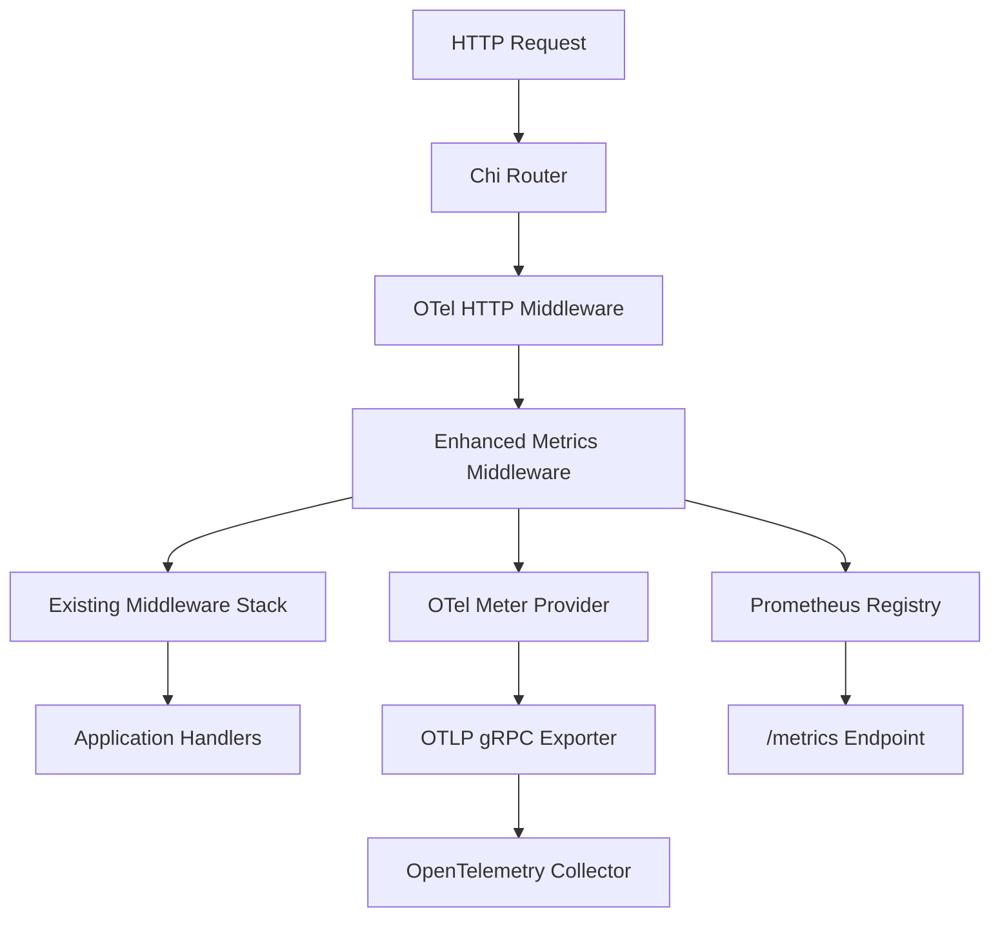

# Design Document

## Overview

This design implements enhanced HTTP metrics for the portfolio accounting service by creating a new OpenTelemetry-based metrics middleware that works alongside the existing Prometheus metrics system. The solution leverages the already integrated OpenTelemetry libraries and OTLP gRPC exporter to provide standardized HTTP request metrics that feed directly into the OpenTelemetry Collector.

The design ensures backward compatibility with existing metrics while adding the three required custom metrics: request counter, duration histogram, and in-flight gauge.

## Architecture

### High-Level Architecture



### Integration Points

1. **OpenTelemetry Integration**: Uses the existing `otel.GetMeterProvider()` to create metrics
2. **Middleware Stack**: Integrates into the existing Chi middleware chain
3. **Metrics Export**: Leverages the existing OTLP gRPC exporter configuration
4. **Coexistence**: Works alongside existing Prometheus metrics without conflicts

## Components and Interfaces

### 1. Enhanced Metrics Middleware

**Location**: `internal/api/middleware/enhanced_metrics.go`

```go
type EnhancedMetricsMiddleware struct {
    // OpenTelemetry metrics
    httpRequestsTotal     metric.Int64Counter
    httpRequestDuration   metric.Float64Histogram  
    httpRequestsInFlight  metric.Int64UpDownCounter
    
    // Configuration
    serviceName string
    meter       metric.Meter
}

type EnhancedMetricsConfig struct {
    ServiceName string
    Enabled     bool
}
```

**Key Methods**:
- `NewEnhancedMetricsMiddleware(config EnhancedMetricsConfig) *EnhancedMetricsMiddleware`
- `Handler() func(http.Handler) http.Handler`
- `initializeMetrics() error`

### 2. Metrics Definitions

#### HTTP Requests Total Counter
- **Name**: `http_requests_total`
- **Type**: `metric.Int64Counter`
- **Labels**: `method`, `path`, `status`
- **Unit**: Requests (dimensionless)

#### HTTP Request Duration Histogram  
- **Name**: `http_request_duration`
- **Type**: `metric.Float64Histogram`
- **Labels**: `method`, `path`, `status`
- **Unit**: Milliseconds
- **Buckets**: `[5, 10, 25, 50, 100, 250, 500, 1000, 2500, 5000, 10000]` (milliseconds)

#### HTTP Requests In Flight Gauge
- **Name**: `http_requests_in_flight`
- **Type**: `metric.Int64UpDownCounter`
- **Labels**: None
- **Unit**: Requests (dimensionless)

### 3. Response Writer Wrapper

**Location**: `internal/api/middleware/enhanced_metrics.go`

```go
type enhancedMetricsResponseWriter struct {
    http.ResponseWriter
    statusCode int
    written    bool
}
```

Captures HTTP status codes for accurate labeling.

### 4. Path Pattern Extraction

**Function**: `extractPathPattern(path string) string`

Maps actual request paths to route patterns:
- `/api/v1/transaction/123` → `/api/v1/transaction/{id}`
- `/api/v1/portfolios/456/summary` → `/api/v1/portfolios/{portfolioId}/summary`
- `/health` → `/health`

### 5. Integration Configuration

**Location**: `internal/api/routes/routes.go`

Modified `SetupRouter` function to include enhanced metrics middleware in the middleware stack.

## Data Models

### Metric Labels Structure

```go
type MetricLabels struct {
    Method string // HTTP method (GET, POST, etc.)
    Path   string // Route pattern (/api/v1/transactions)
    Status string // HTTP status code as string ("200", "404")
}
```

### Timing Data

```go
type RequestTiming struct {
    StartTime time.Time
    Duration  time.Duration
}
```

## Error Handling

### Graceful Degradation Strategy

1. **Metrics Initialization Failure**:
   - Log error at WARN level
   - Continue middleware execution without metrics
   - Service remains operational

2. **Metric Recording Failure**:
   - Log error at ERROR level
   - Continue request processing
   - Don't block HTTP response

3. **OpenTelemetry Provider Unavailable**:
   - Detect during initialization
   - Disable enhanced metrics
   - Fall back to existing Prometheus metrics only

### Error Recovery

```go
func (m *EnhancedMetricsMiddleware) recordMetricSafely(
    recordFunc func() error,
    metricName string,
) {
    if err := recordFunc(); err != nil {
        m.logger.Error("Failed to record metric",
            zap.String("metric", metricName),
            zap.Error(err))
    }
}
```

## Testing Strategy

### Unit Tests

**Location**: `internal/api/middleware/enhanced_metrics_test.go`

1. **Metrics Creation Tests**:
   - Verify all three metrics are properly initialized
   - Test metric registration with OpenTelemetry
   - Validate metric names and descriptions

2. **Middleware Functionality Tests**:
   - Counter increments on each request
   - Histogram records accurate durations
   - Gauge tracks concurrent requests correctly
   - Labels contain expected values

3. **Error Handling Tests**:
   - Metrics failure doesn't break request processing
   - Graceful degradation when OTel unavailable
   - Proper error logging

### Integration Tests

**Location**: `tests/integration/enhanced_metrics_integration_test.go`

1. **End-to-End Metrics Flow**:
   - Make HTTP requests to various endpoints
   - Verify metrics appear in OpenTelemetry exports
   - Validate metric values and labels

2. **Concurrent Request Testing**:
   - Multiple simultaneous requests
   - Verify in-flight gauge accuracy
   - Test race condition handling

3. **Route Pattern Testing**:
   - Test path pattern extraction for all endpoints
   - Verify parameterized routes are properly normalized

### Performance Tests

1. **Overhead Measurement**:
   - Benchmark middleware performance impact
   - Memory usage analysis
   - Latency impact assessment

2. **High Load Testing**:
   - Stress test with high request volumes
   - Verify metrics accuracy under load
   - Test memory leak prevention

## Implementation Phases

### Phase 1: Core Middleware Implementation
- Create `EnhancedMetricsMiddleware` struct
- Implement OpenTelemetry metric initialization
- Create basic middleware handler function
- Add path pattern extraction logic

### Phase 2: Integration and Configuration
- Integrate middleware into router setup
- Add configuration options
- Implement error handling and logging
- Create response writer wrapper

### Phase 3: Testing and Validation
- Write comprehensive unit tests
- Create integration tests
- Performance testing and optimization
- Documentation updates

### Phase 4: Deployment Preparation
- Validate metrics export to OpenTelemetry Collector
- Test coexistence with existing Prometheus metrics
- Create monitoring dashboards
- Prepare deployment documentation

## Performance Considerations

### Optimization Strategies

1. **Efficient Label Creation**:
   - Pre-allocate label slices
   - Reuse common label combinations
   - Minimize string allocations

2. **Path Pattern Caching**:
   - Cache frequently accessed path patterns
   - Use sync.Map for concurrent access
   - Implement LRU eviction for memory management

3. **Timing Precision**:
   - Use `time.Now()` for microsecond accuracy
   - Convert to milliseconds for histogram recording
   - Minimize timing overhead

### Memory Management

1. **Metric Instance Reuse**:
   - Create metrics once during initialization
   - Reuse metric instances across requests
   - Avoid creating new metric objects per request

2. **Label Value Limits**:
   - Implement cardinality limits for path labels
   - Sanitize dynamic path segments
   - Prevent memory leaks from high-cardinality metrics

## Security Considerations

### Data Privacy

1. **Path Sanitization**:
   - Remove sensitive data from path labels
   - Normalize user IDs and tokens
   - Use generic patterns for parameterized routes

2. **Error Information**:
   - Don't expose sensitive data in error logs
   - Sanitize error messages in metrics
   - Limit error detail in production

### Resource Protection

1. **Rate Limiting**:
   - Prevent metrics spam attacks
   - Implement reasonable cardinality limits
   - Monitor metric creation rates

2. **Memory Protection**:
   - Set maximum label value lengths
   - Implement metric cleanup for unused labels
   - Monitor memory usage patterns

## Monitoring and Observability

### Metrics Validation

1. **Self-Monitoring**:
   - Track metrics middleware performance
   - Monitor metric recording success rates
   - Alert on metric export failures

2. **Consistency Checks**:
   - Compare with existing Prometheus metrics
   - Validate metric accuracy
   - Monitor for discrepancies

### Operational Dashboards

1. **HTTP Request Metrics**:
   - Request rate by endpoint
   - Response time percentiles
   - Error rate monitoring
   - Concurrent request tracking

2. **Service Health**:
   - Metrics export success rate
   - Middleware performance impact
   - OpenTelemetry collector connectivity

## Deployment Strategy

### Rollout Plan

1. **Development Environment**:
   - Deploy with feature flag disabled
   - Enable for testing and validation
   - Performance baseline establishment

2. **Staging Environment**:
   - Enable enhanced metrics
   - Validate OpenTelemetry Collector integration
   - Load testing and monitoring

3. **Production Rollout**:
   - Gradual rollout with monitoring
   - Fallback plan to existing metrics
   - Performance monitoring and alerting

### Configuration Management

```yaml
# config.yaml
metrics:
  enhanced:
    enabled: true
    service_name: "portfolio-accounting-service"
  prometheus:
    enabled: true  # Keep existing metrics
```

### Backward Compatibility

- Existing Prometheus metrics remain unchanged
- `/metrics` endpoint continues to work
- No breaking changes to existing monitoring
- Gradual migration path for dashboards